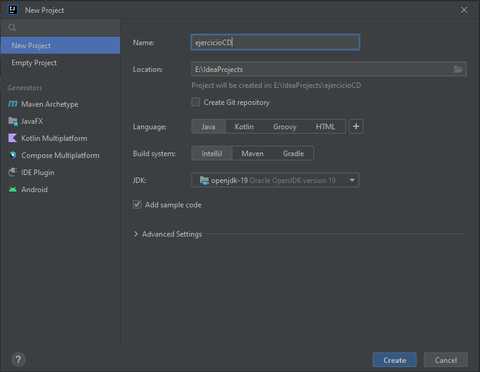
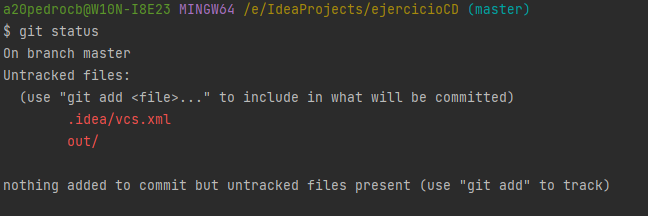

# Pasos realizados

1. Creación de un proyecto en IntelliJ



2. Primer commit:

```bash
$ git init
$ git add .
$ git commit -m "ejercicioCD_1"
```

3. Ejecuto el amain y segundo commit:

```bash
$ git status
```

```bash
$ git add .
$ git commit -m "ejercicioCD_2"
```
